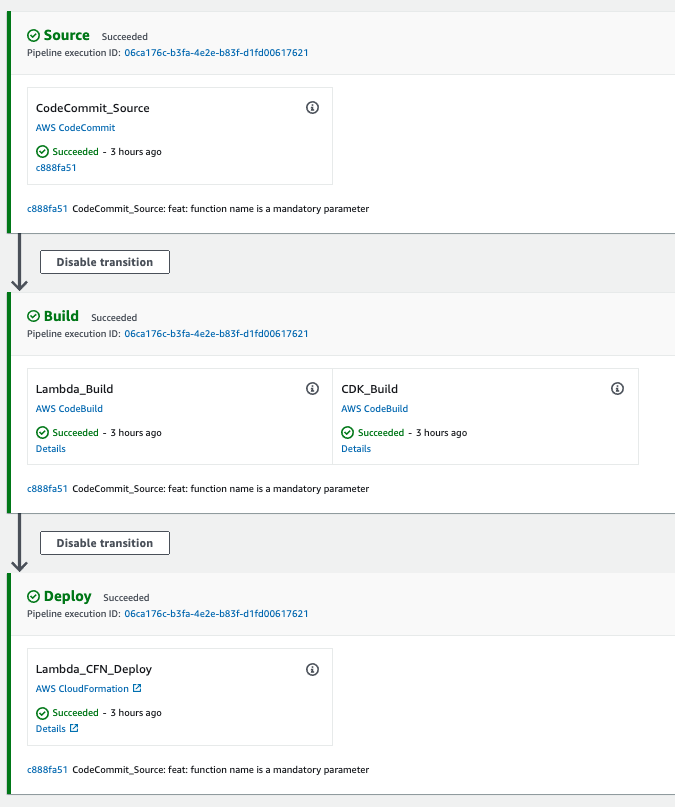
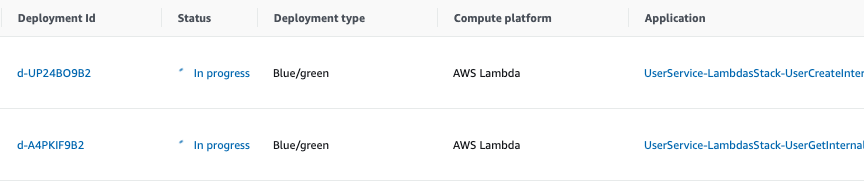
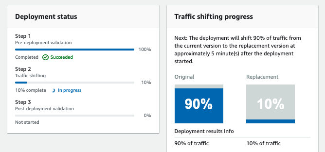

# aws-cdk-lambda-blue-green
 CDK construct for an AWS Lambda function with blue-green/canary deployment configuration.

## [Constructs](https://docs.aws.amazon.com/cdk/latest/guide/constructs.html)
 This module expose the following constructs.

 * LambdaBlueGreen - Defines a lambda function and a deployment group. Deployment mode is configurable and there is
  an optional pre-hook lambda which can be specified for validating the lambda being deployed as a blue-green
  /canary deployment.
 * Pipeline - Defines the aws code pipeline
 
 There is an AppBuilder class created as a wrapper just to demonstrate how the stacks can be created in a programmatic
  approach. Not sure if I have over-engineered it a bit :)  

## Usage
 A sample project using these constructs and builder classes can be found under the `sample` folder.
 
 The following code snippet will create a pipeline and two lambda functions in the specified aws account.
 
 ```
 new AppBuilder({
     appName: "UserService",
     pipelineConfig: {
         codeCommitRepoName: 'user-service',
         codeCommitRepoBranchName: 'develop',
         lambdaBuildSpecFile: 'sample/config/lambda-buildspec.yml',
         cdkBuildSpecFile: 'sample/config/cdk-buildspec.yml'
     }
 })
     .addFunction({
         functionName: "UserCreate",
         preHookHandlerName: "userCreateValidatorPreHook.handler",
         handlerName: "userCreate.handler",
         lambdaAliasName: 'live'
     })
     .addFunction({
         functionName: "UserGet",
         preHookHandlerName: "userGetValidatorPreHook.handler",
         handlerName: "userGet.handler",
         lambdaAliasName: 'live'
     })
     .build()   
 ``` 

The lambda handlers inside the sample folder:
```
└── lambda
    ├── userCreate.ts                   # Create User Function (demostration purpose only)
    ├── userCreateValidatorPreHook.ts   # Validation pre-kook function 
    ├── userGet.ts                      # Get User Function (demostration purpose only)
    └── userGetValidatorPreHook.ts      # Validation pre-kook function 

```
## Deployment of the Pipeline
The above snippet will create two stacks one for the pipeline and second for the lambda and related resources.

 * Build the project and execute tests
```
npm run build
npm run test
``` 
 * List the available stacks 
```
cdk list UserService-PipelineStack
```
 * View the synthesised cloud formation template and then deploy the stack
```
cdk synth UserService-PipelineStack
cdk deploy UserService-PipelineStack --profile dev
``` 

## Pipeline View
Once the pipeline stack is deployed and a commit is made to the origin the pipeline is triggered.



Blue green deployment for the two lambdas.



Pre-hook lambda execution and traffic shifting during the deployment.



## References
 * [AWS-CDK](https://docs.aws.amazon.com/cdk/latest/guide/home.html)
 * [CodeDeploy Lambda Deployments](https://docs.aws.amazon.com/codedeploy/latest/userguide/applications-create-lambda.html)

